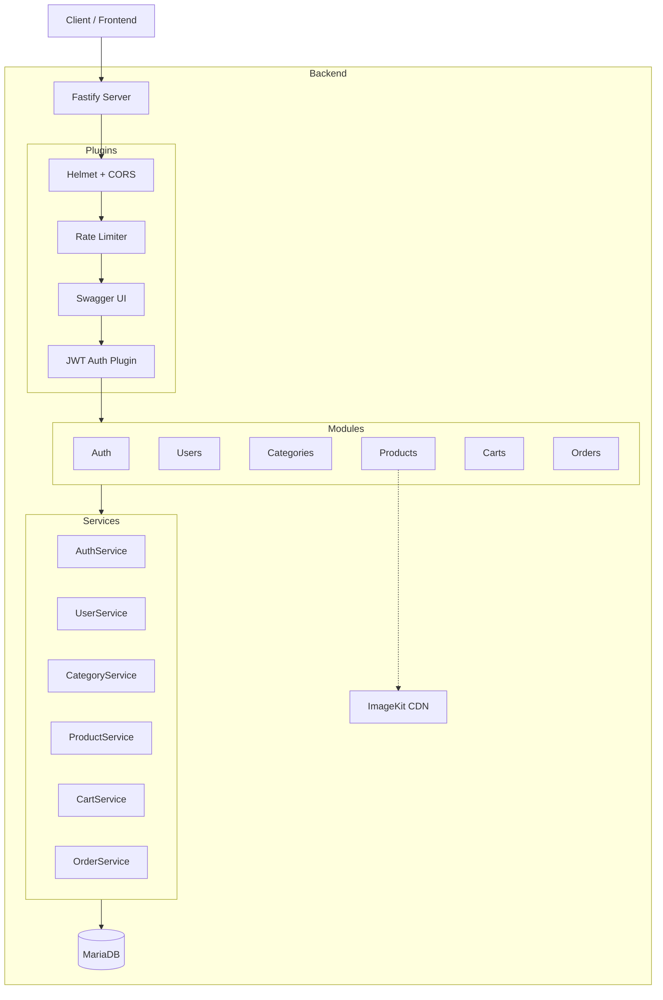
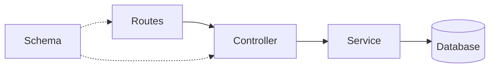
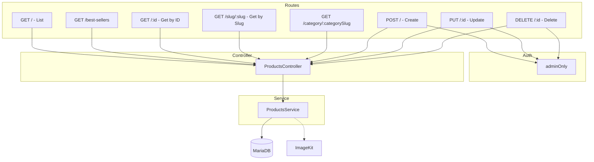
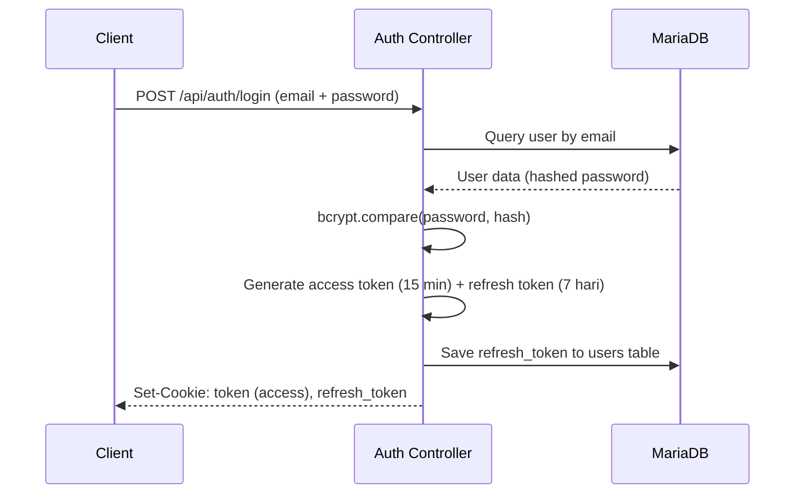
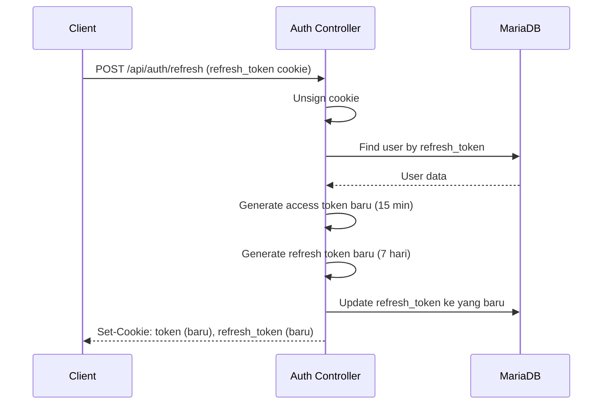
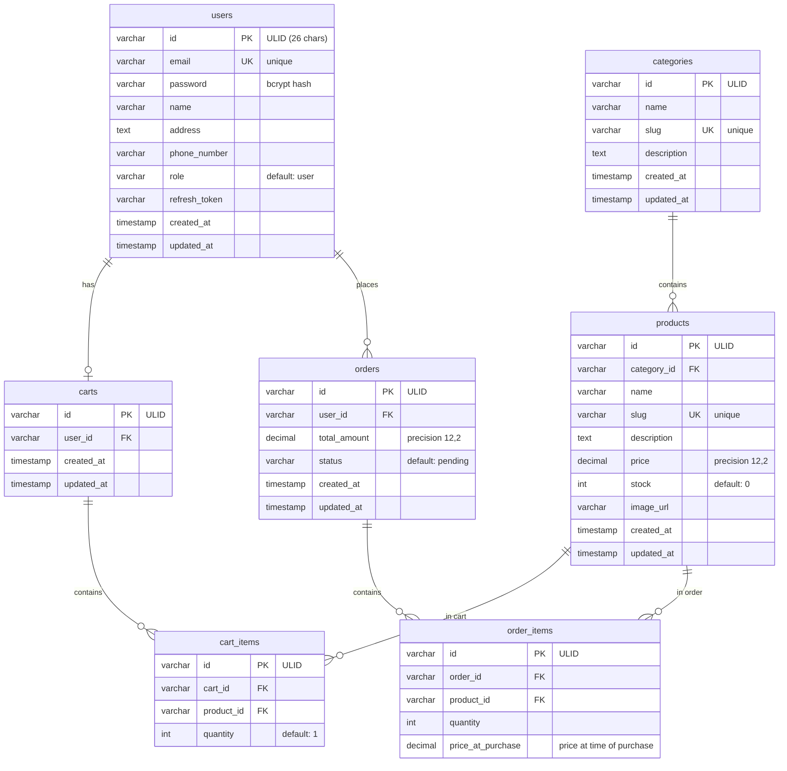

# Arsitektur Backend E-Commerce

Dokumentasi ini menjelaskan arsitektur, alur data, dan struktur modul pada backend aplikasi e-commerce.

## Tech Stack

| Layer | Teknologi |
|-------|-----------|
| Runtime | Node.js (ESM) |
| Framework | Fastify 5 |
| Validasi | TypeBox + @fastify/type-provider-typebox |
| ORM | Drizzle ORM (MySQL dialect) |
| Database | MariaDB LTS (via Docker) |
| Auth | JWT (HttpOnly signed cookies) |
| Password Hashing | bcrypt |
| ID Generator | ULID (26 karakter) |
| Image Upload | ImageKit |
| Security | Helmet, CORS, Rate Limiting, Input Sanitization |
| API Docs | Swagger UI (`/docs`) |
| Testing | Vitest |

## High-Level Architecture



## Request Flow

Setiap request HTTP melalui pipeline berikut:

```mermaid
sequenceDiagram
    participant C as Client
    participant S as Fastify Server
    participant P as Plugin Chain
    participant R as Route
    participant Ctrl as Controller
    participantSvc as Service
    participant DB as MariaDB

    C->>S: HTTP Request
    S->>P: Security (Helmet, CORS)
    P->>P: Rate Limit Check
    P->>P: Cookie Parsing
    P->>P: JWT Verification (jika route protected)
    P->>R: Route matching
    R->>Ctrl: Invoke controller method
    Ctrl->>Svc: Call service method
    Svc->>DB: Query via Drizzle
    DB-->>Svc: Result
    Svc-->>Ctrl: Data
    Ctrl-->>C: Standard Response
```

## Plugin Chain

Plugin didaftarkan secara berurutan di `src/app.ts`:

| Urutan | Plugin | Fungsi |
|--------|--------|--------|
| 1 | Security Plugin | Helmet (CSP headers) + CORS |
| 2 | Rate Limit Plugin | Register: 3/menit, Login: 5/menit, Refresh: 10/menit, Global: 100/menit |
| 3 | Swagger Plugin | OpenAPI docs di `/docs` |
| 4 | Cookie Plugin | Parse & sign cookies dengan `COOKIE_SECRET` |
| 5 | JWT Plugin | Sign & verify JWT dengan `JWT_SECRET` |
| 6 | Multipart Plugin | Upload file (maks 5MB) |
| 7 | Auth Plugin | Decorator `authenticate` & `adminOnly` |

## Module Pattern

Setiap modul di `src/modules/<name>/` mengikuti struktur yang konsisten:

```
src/modules/<name>/
├── <name>.schema.ts      # TypeBox validation schemas
├── <name>.service.ts     # Database queries via Drizzle
├── <name>.controller.ts  # Request handlers
├── <name>.routes.ts      # Fastify route registration
└── tests/
    └── <name>.test.ts    # Integration tests
```

### Alur Komponen Modul



- **Routes** — Mendaftarkan endpoint, memetakan ke controller, menentukan auth level
- **Controller** — Menerima request, memanggil service, mengembalikan response
- **Service** — Logika bisnis, query database, generate ULID
- **Schema** — Validasi request body/params/query menggunakan TypeBox

### Contoh: Products Module



## Authentication System

Autentikasi menggunakan JWT yang disimpan di HttpOnly signed cookies.

### Flow Login



### Refresh Token Rotation

Refresh token di-rotate setiap kali digunakan untuk keamanan:



> Refresh token lama akan **invalid** setelah digunakan. Jika ada reuse refresh token lama, request akan ditolak.

### Auth Guards

| Guard | Fungsi | Dipakai di |
|-------|--------|-----------|
| `authenticate` | Verifikasi JWT dari cookie. Jika gagal, langsung return 401 dan menghentikan request. | Auth (change-password), Carts, Orders, Users (profile) |
| `adminOnly` | `authenticate` + cek `role === 'admin'`. Jika authenticate gagal (`reply.sent`), langsung return. Jika role bukan admin, return 403. | Products (CRUD), Users (admin), Categories (write), Orders (admin) |

> **Catatan:** Route `/register` bersifat public untuk role `user`. Untuk role `admin`, autentikasi diperiksa di controller (bukan di hook).

### Token Structure

```json
{
  "id": "user_ulid",
  "email": "user@example.com",
  "role": "user" | "admin"
}
```

## Database Schema

### Entity Relationship Diagram



### Tabel Summary

| Tabel | Fungsi | Relasi Utama |
|-------|--------|-------------|
| `users` | Data pengguna + autentikasi | 1:1 carts, 1:N orders |
| `categories` | Kategori produk | 1:N products |
| `products` | Data produk | N:1 categories, N:1 cart_items, N:1 order_items |
| `carts` | Keranjang belanja | N:1 users, 1:N cart_items |
| `cart_items` | Item dalam keranjang | N:1 carts, N:1 products |
| `orders` | Pesanan | N:1 users, 1:N order_items |
| `order_items` | Item dalam pesanan | N:1 orders, N:1 products |

### Indexes

| Tabel | Index | Kolom | Tipe |
|-------|-------|-------|------|
| products | `name_idx` | name | B-Tree |
| products | `slug_idx` | slug | B-Tree |
| products | `description_idx` | description | B-Tree |
| products | `name_fulltext_idx` | name | FULLTEXT |
| products | `desc_fulltext_idx` | description | FULLTEXT |
| cart_items | `cart_id_idx` | cart_id | B-Tree |
| cart_items | `product_id_idx` | product_id | B-Tree |
| orders | `user_id_idx` | user_id | B-Tree |
| orders | `created_at_idx` | created_at | B-Tree |

## Response Format

Semua API response mengikuti format standar (termasuk error dari auth plugin):

```json
{
  "metadata": {
    "code": 200,
    "message": "Success"
  },
  "data": { ... },
  "error": { "field": "message" }
}
```

- **Success** — `metadata.code` + `data`
- **Error** — `metadata.code` + `error` (field-level validation errors)

> **Note:** Auth plugin (`authenticate` & `adminOnly`) juga menggunakan format ini via `formatError()`.

Fungsi utilitas:
- `formatSuccess(reply, data, message)` — response sukses
- `formatError(code, message, validationErrors?)` — response error
- `reply.success(data, message)` — decorator untuk reply

## API Routes

| Prefix | Module | Auth |
|--------|--------|------|
| `/api/auth` | Auth (login, register, refresh, logout) | Public (register admin: adminOnly) |
| `/api/users` | User management | Profile: authenticate, Admin: adminOnly |
| `/api/categories` | Product categories | Public (read), adminOnly (write) |
| `/api/products` | Product CRUD + search | Public (read), adminOnly (write) |
| `/api/carts` | Shopping cart | authenticate |
| `/api/orders` | Orders + reporting | authenticate (stock validation di dalam transaction) |
| `/health` | Health check | Public |

## Logging

Menggunakan built-in Fastify logger (`request.log`). Level: `info` (dev) / `warn` (prod).

**Events yang di-log:**
- `warn` — JWT verification failed, login failed, refresh token invalid, order creation failed
- `info` — Request/response lifecycle (otomatis dari Fastify)

## Rate Limiting

Menggunakan `@fastify/rate-limit` dengan konfigurasi:

| Endpoint | Limit | Window |
|----------|-------|--------|
| Register | 3 req | 1 menit |
| Login | 5 req | 1 menit |
| Refresh | 10 req | 1 menit |
| Global (lainnya) | 100 req | 1 menit |

Response saat limit tercapai:
```json
{
  "statusCode": 429,
  "error": "Too Many Requests",
  "message": "Rate limit exceeded. Maximum 5 requests per minute allowed."
}
```

---

## Configuration

### Environment Variables

Divalidasi otomatis saat startup menggunakan TypeBox. Lihat `src/config/env.ts`.

| Variable | Required | Default | Deskripsi |
|----------|----------|---------|-----------|
| NODE_ENV | No | development | Mode aplikasi |
| PORT | No | 3000 | Port server |
| HOST | No | 0.0.0.0 | Bind address |
| DATABASE_HOST | Yes | - | Host MariaDB |
| DATABASE_PORT | No | 3306 | Port MariaDB |
| DATABASE_USER | Yes | - | Username DB |
| DATABASE_PASSWORD | Yes | - | Password DB |
| DATABASE_NAME | Yes | - | Nama database |
| DATABASE_ROOT_PASSWORD | No | root_sandi_skripsi_aman | Root password MariaDB (Docker) |
| JWT_SECRET | Yes | - | Secret key JWT |
| COOKIE_SECRET | Yes | - | Secret key cookies |
| COOKIE_SAMESITE | No | lax | SameSite policy (strict/lax/none) |
| COOKIE_SECURE | No | false | Cookie hanya via HTTPS |
| COOKIE_DOMAIN | No | - | Domain scope (contoh: .example.com) |
| COOKIE_PATH | No | / | Path scope untuk access token |
| REFRESH_COOKIE_PATH | No | /api/auth/refresh | Path scope untuk refresh token |
| IMAGEKIT_PUBLIC_KEY | Yes | - | ImageKit public key |
| IMAGEKIT_PRIVATE_KEY | Yes | - | ImageKit private key |
| IMAGEKIT_URL_ENDPOINT | Yes | - | ImageKit URL endpoint |

### Docker (MariaDB)

- Container: `database_skripsi`
- Bind: `127.0.0.1:3306` (hanya localhost)
- Charset: `utf8mb4_unicode_ci`
- Timezone: `Asia/Jakarta` (+07:00)
- Memory limit: 512MB
- Max connections: 50

## Directory Structure

```
backend/
├── docker-compose.yml          # MariaDB container
├── drizzle.config.ts           # Drizzle Kit config
├── drizzle/                    # SQL migrations
├── scripts/
│   └── setup-fulltext.js       # FULLTEXT index setup
├── src/
│   ├── app.ts                  # Fastify app factory
│   ├── server.ts               # Entry point
│   ├── config/
│   │   ├── database.ts         # MySQL pool + Drizzle
│   │   └── env.ts              # Env validation
│   ├── db/
│   │   ├── index.ts            # Re-exports schema
│   │   └── schema.ts           # All tables + relations
│   ├── modules/
│   │   ├── auth/               # Authentication
│   │   ├── users/              # User management
│   │   ├── categories/         # Product categories
│   │   ├── products/           # Product CRUD + search
│   │   ├── carts/              # Shopping cart
│   │   └── orders/             # Orders + reporting
│   ├── plugins/
│   │   ├── auth.plugin.ts      # JWT auth guards
│   │   ├── rate-limit.plugin.ts
│   │   ├── security.plugin.ts
│   │   └── swagger.plugin.ts
│   └── shared/
│       └── utils/
│           ├── hash.util.ts    # bcrypt helpers
│           ├── imagekit.util.ts
│           ├── response.util.ts
│           └── sanitize.util.ts # Input sanitization
├── tests/
│   └── setup.ts                # Vitest global setup
├── .env.example                # Env template
├── package.json
└── vitest.config.ts
```
